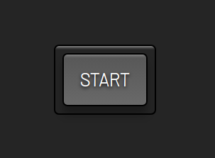

# Picture in Picture -> [LIVE DEMO](https://shcoobz.github.io/picture-in-picture/)

## Summary

Picture in Picture is a straightforward web application that demonstrates the use of the Picture in Picture (PiP) functionality in modern web browsers. By leveraging browser APIs and media streams, it allows users to watch video content in a floating window that stays on top of other windows, enabling multitasking on the web.

The core functionality includes:

- Enabling PiP mode for video streams within the browser.
- Utilizing browser media streams to select and play videos.
- Offering a responsive and intuitive interface for a seamless user experience.

## Features

### Picture in Picture Mode

Allows users to watch videos in a floating window that can be moved and resized, enabling them to continue viewing content while interacting with other sites or applications.

### Browser Media Stream Integration

The application integrates with the browser's media stream API to facilitate easy access and control of video content, demonstrating the capabilities of modern web development.

### Responsive and Intuitive Design

The design of the application is both responsive, ensuring it works well on devices of various sizes, and intuitive, making it easy for users to engage with the PiP functionality.

### Additional Features

- **Simplified User Experience:** Focuses on simplicity and ease of use, with minimal clicks required to activate PiP mode.
- **Customizable Appearance:** Users have the option to customize the look and feel of the video player and controls via CSS.

## Technologies

- **HTML/CSS:** Used for structuring and styling the application's user interface.
- **JavaScript:** Implements the logic for activating PiP mode, handling media streams, and interacting with the browser API.
- **Browser API:** Utilizes the Picture in Picture API provided by modern browsers to offer the PiP functionality.

---

_Note: This document provides an overview of Picture in Picture. For detailed instructions and more information, please refer to the source code documentation._
